# Setup.py Features for Kalenjin Dictionary Processing Framework

Your `setup.py` is now a comprehensive, professional-grade installation script that provides complete package management for the Kalenjin Dictionary Processing Framework with vLLM integration.

## 🎯 **Key Features**

### **1. Professional Package Configuration**
```python
setup(
    name="kalenjin-dictionary-processor",
    version="1.0.0",
    description="AI-powered framework for processing Kalenjin dictionary PDFs using vision-language models with vLLM integration",
    # ... comprehensive metadata
)
```

### **2. Flexible Installation Options**
```bash
# Basic installation (CPU only)
pip install .

# Full installation with vLLM server
pip install .[vllm]

# Development installation  
pip install .[dev]

# Everything included
pip install .[all]
```

### **3. Smart Dependency Management**
- **Core Dependencies**: PyTorch, Transformers, PIL, PyMuPDF
- **vLLM Optional**: vLLM, FastAPI, Uvicorn for high-performance serving
- **Development Tools**: pytest, black, mypy for code quality
- **HTTP Clients**: httpx, aiohttp for distributed processing

### **4. Console Command Integration**
```bash
# Installed as system commands
kalenjin-process          # Main processing CLI
start-vllm-server        # Start vLLM server
test-vllm                # Test server connection
kalenjin-setup           # Run post-install setup
```

### **5. Automated Environment Setup**
- ✅ Creates `.env` configuration file with defaults
- ✅ Sets up directory structure (output, images, results, logs, cache)
- ✅ Detects CUDA availability and configures accordingly
- ✅ Validates Python version compatibility (3.8+)

### **6. Professional Package Metadata**
- **Classifiers**: Proper PyPI categories for discoverability
- **Keywords**: Comprehensive tagging for search
- **Project URLs**: Links to documentation, issues, source
- **License**: MIT license specification
- **Platform Support**: Cross-platform compatibility

## 📦 **Installation Methods**

### **Method 1: Interactive Installation**
```bash
python install.py
# Prompts for installation type selection
```

### **Method 2: Direct Installation**
```bash
# Basic (CPU only)
python install.py --basic

# Full with vLLM server
python install.py --full  

# Development mode
python install.py --dev
```

### **Method 3: Standard pip**
```bash
pip install .                    # Basic
pip install .[vllm]             # With vLLM
pip install .[dev]              # Development
pip install .[all]              # Everything
```

### **Method 4: Post-Install Setup**
```bash
python setup.py                 # Run setup functions
kalenjin-setup                  # After pip install
```

## 🔧 **Setup Process Flow**

```mermaid
graph TD
    A[Run setup.py] --> B[Check Python 3.8+]
    B --> C[Install PyTorch + CUDA]
    C --> D[Install Core Dependencies]
    D --> E[Install Optional Dependencies]
    E --> F[Create .env Configuration]
    F --> G[Setup Directory Structure]
    G --> H[Check GPU Availability]
    H --> I[Register Console Commands]
    I --> J[✅ Ready to Process!]
```



## 🌟 **What This Provides**

### **For Users:**
- **One-Command Setup**: `pip install .[vllm]` gets everything working
- **Automatic Configuration**: Smart defaults for immediate use
- **Multiple Options**: Choose basic CPU or full GPU+vLLM setup
- **System Integration**: Commands available system-wide

### **For Developers:**
- **Development Mode**: `pip install -e .[all]` for active development
- **Testing Tools**: pytest, code formatters included
- **Package Data**: All necessary files included in distribution
- **Proper Versioning**: Semantic versioning with metadata

### **For Production:**
- **vLLM Integration**: High-performance model serving
- **Scalable Architecture**: REST API for distributed processing
- **Resource Management**: Automatic GPU detection and configuration
- **Monitoring**: Health checks and logging setup

## 🚀 **Usage Examples**

### **Quick Start (New User)**
```bash
git clone <your-repo>
cd kalenjin-dictionary-processor
python install.py --full
kalenjin-process pipeline dictionary.pdf --use-vllm-server
```

### **Development Setup**
```bash
pip install -e .[all]
python setup.py  # Run post-install setup
python test_vllm.py  # Test installation
```

### **Production Deployment**
```bash
pip install .[vllm]
start-vllm-server --port 8000
kalenjin-process batch ./pdfs --use-vllm-server --output ./results
```

## 📋 **Configuration Created**

Your setup automatically creates `.env` with:
```env
# Model Configuration
MODEL_NAME=nvidia/Cosmos-Reason1-7B
DEVICE=auto
BATCH_SIZE=2

# vLLM Server
VLLM_SERVER_URL=http://localhost:8000
VLLM_GPU_MEMORY_UTILIZATION=0.85
VLLM_MAX_NUM_SEQS=4

# Processing
DEFAULT_DPI=300
OUTPUT_DIR=./output
```

## 🎉 **The Result**

Your `setup.py` now provides:
- ✅ **Professional Package Distribution** - Ready for PyPI
- ✅ **Flexible Installation Options** - CPU, GPU, vLLM, dev modes  
- ✅ **Automatic Environment Setup** - Zero manual configuration
- ✅ **System Integration** - Console commands available globally
- ✅ **Production Ready** - Scalable vLLM server integration
- ✅ **Developer Friendly** - All tools included for development

This is now a **enterprise-grade setup script** that handles everything from basic CPU processing to high-performance vLLM server deployment for your Kalenjin dictionary processing framework! 🚀
